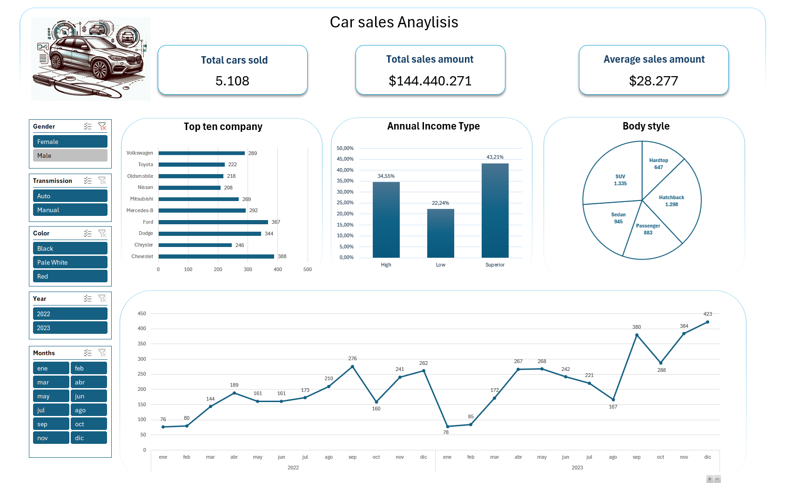

# Proyecto de Análisis de las ventas de coches en EE.UU

    

Este proyecto tiene como objetivo analizar las tendencias de ventas de coches, utilziando datos históricos de los años 2022 a 2023 y mostrando los resultados en un dashboard interactivo.    

## Descripción del proyecto
El análisis de las ventas de coches en los estados unidos durante los años 2022 y 2023 busca identificar tendencias, patrones de compra y factores que influyen en el mercado automovilístico.  

## Estructura del proyecto

## Datos
Descargamos el fichero desde la URL https://www.kaggle.com/datasets/safaeahb/car-sales-analysis-dashboard?select=car+sales.csv    

## Tecnologías Utilizadas
- Excel

## Estructura de datos

El archivo de datos original consta de las siguientes conlumnas:  
- **Car_id:** identificador único de la venta.  
- **Date:** Fecha de la venta del vehículo.
- **Customer_Name:** Nombre del cliente que ha comprado el coche.
- **Gender:** Género del cliente que ha comprado el coche.
- **Annual Income:** Ingresos anuales del comprador del coche.
- **Dealer_Name:** Nombre del concesionario.
- **Company:** Marca del coche que se ha vendido.
- **Model:** Modelo del coche que se ha vendido
- **Engine:** Tipo de motor del coche vendido. 
- **Transmission:** Tipo de transmisión del coche.
- **Color:** Color del coche.
- **Price ($):** Precio que ha costado el coche:
- **Dealer_No:** Número del concesionario.
- **Body Style:** Estilo de la corrocería del coche.
- **Phone:** Télefono. Puede que sea el teléfono del comprador del coche. Es una columna irrevelente, así que no le vamos a dar importancia.
- **Dealer_Region:** Región del concesionario.

## Desarrollo del proyecto

Entendimiento general del conjunto de datos y de las columnas.
Eliminación de columnas, establecimiento del tipo de los datos y normalización de los datos.
Análisis descriptivo de las columnas numéricas.
Análisis descriptivo de las columnas categóricas y temporales.
Análisis descriptivo de las columnas numéricas y la columna objetivo.
Análisis descriptivo de las columnas categóricas y temporales. Creación de nuevas columnas.
Elección de las columnas relevantes para el dashboard.
Creación del dashboard.

## Dashboard

    

## Conclusiones
- Existe una tendencia al alza en la ventas, ya que 2023 supera en ventas al año 2022.  
- Los meses donde más coches se compran son los meses de final de año.  
- Las marcas americanas son las marcas con mayores ventas.  
- Los coches de tipo de SUV son los favoriros de los compradores.  
- El perfíl de comprador de coches son los que tienen ingresos superiores.

## Contribuciones
Las contribuciones a este proyecto son bienvenidas. Si tienes alguna sugerencia, mejora o corrección, no dudes en ponerte en contacto o enviar tus ideas.

## Autor
Sergio Salmerón - [GitHub Profile](https://github.com/SergioSalm)